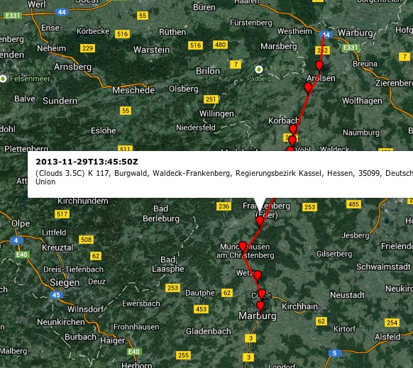

# OwnTracks to Storage (m2s)

This is part of the OwnTracks back-end. This program subscribes to a configured MQTT topic (default: `owntracks/+/+`), extracts the JSON payload from received messages, optionally looks up weather and reverse-geo and others via plugins for the reported `lat` and `lon`, and stores the result. Storage is pluggable (see below), and we provide a default MySQL storage plugin.


```

                    +-------------------------+
                    |         m2s             |
                    |-------------------------|
                    |                         |
         +--------->| +---------+             |
                    |           |             |
                    |           |             |
                    |     +-----v-------+     |       +----------------+
                    |     |             +------------>| OpenWeatherMap |
                    |     |             |     |       +----------------+
                    |     |   Queue     |     |       
                    |     |             +------------>+----------------+
                    |     +-----+-------+     |       | Nominatim (Geo)|
                    |           |             |       +----------------+
                    |           |             |
                    |     +-----v-------+     |
                    |     | storage.py  |     |
                    |     |-------------|     |
                    |     |    SQL      |     |
                    |     |   NoSQL     |     |
                    |     |   Files     |     |
                    |     +-------------+     |
                    |                         |
                    +-------------------------+
```

### Configuration

1. Copy `settings.py.sample` to `settings.py` and edit. Note that this must be valid Python code
2. Pay particular attention to the _data_plugins_, which you can write yourself. 
3. If you want to place `settings.py` in a different path, set `$M2SCONFIG` to the path to `settings.py`.

### Data Plugins

Data plugins allow me to invoke a list of plugins in the order I specify in settings. For example:

```python
data_plugins = [
    dict(column='weather',      filename='pl-weather.py'),
    dict(column='revgeo',       filename='pl-revgeo.py'),
    dict(column='plrepublish',  filename='pl-republish.py'),
]
```

The three plugins called `weather`, `revgeo`, and `plrepublish` are loaded from the specified Python files. When `m2s` receives a message, it decodes the JSON into what we internally call an _item_. This _item_ is handed from plugin to plugin in the order you configure them to be invoked, and plugins may add values to that item by returning a value. So, if the plugin called _revgeo_ returns `"Hello"`, this value is added to the item as

```
item = {
  ...
  'revgeo' : "Hello",
  ...
}
```

Plugins may choose to _not_ return values and act as triggers instead. In order to accomplish that, the plugin must return a tuple of two None. See [pl-example.py](pl-example.py) for an example plugin with a number of examples in the comments.

Each plugin can return a `(string, dict)` tuple. The string value is loaded into the database column named as the plugin (i.e. `weather` and `revgeo`) and can be pre-created in the database schema (see `dbschema.py`) if the column is to be saved to storage. (If the column name you specify doesn't exist in the database, the value will silently be discarded.) The returned _dict_ is merged into the current _item_, whereby existing values _are not_ overwritten. The newly created _item_ is passed on to the next plugin if there is one.

Basically, a plugin looks like this:

```python
def plugin(item, m2s=None):

    lat = item['lat']
    lon = item['lon']

    # do something ...

    value = "*goes into column*"
    new_data = dict(a=1, b=2, c="something else")

    # the resulting JSON in the database will have this key added to it
    data = dict(my_special_data=new_data)

    return  (value, data)
```

`m2s` is an object with the following helper functions:

`m2s.publish(topic, payload, qos=0, retain=False)` publishes to the same broker `m2s` is connected to.
`m2s.info(string=None)` sends `string' (if not None) to the logging.info() channel used by `m2s`.

Furthermore, `m2s` has an object called `cf` which is loaded with configuration settings you can pass to plugins. In order to do that, specify something like the following in `settings.py`:

```python
plugin_configs = {
    "republish_topic" : "local/loca",
    "name" : "JP Mens",
    "size" : "xtralarge",
}
```

That variable's keys are loaded as attributes into the `cf` object. In other words, when your plugins are invoked, you can get my name as

```python
m2s.cf.name
```


### Storage

Storage of data is pluggable, and the default (in `storage.py`) uses peewee and MySQL. See `storage.py` and `settings.py` on how to change that.

### Create database

1. Create MySQL database
2. Check database settings in `settings.py`
3. run `python dbschema.py` to create the necessary tables. In particular, the `location` and `waypoint` tables are created.

#### `waypoint` table

* Note that `tst` is a unique index because waypoints are replaced into the table when you create or modify one.

### Launch

```
./m2s.py
```


### Show

Note how in the example below:

* the column _weather_ has been set by a plugin
* the column _revgeo_ has been set by a plugin
* the column _json_ contains the full JSON of all the data in _item_

```
mysql> SELECT * FROM location;
*************************** 1. row ***************************
      id: 21
   topic: mq/jjolie/ipod
username: jjolie
  device: ipod
     lat: 48.858334
     lon: 2.295134
     tst: 2013-10-23 17:29:51
     acc: 1414m
    json: {"username": "jjolie", "acc": "1414m", "nominatim": {"display_name": "Tour Eiffel, Avenue Pierre Loti, Gros-Caillou, 7e Arrondissement, Paris, \u00cele-de-France, 75725, France m\u00e9tropolitaine, European Union", "place_id": "20399540", "lon": "2.29450008726263", "osm_type": "way", "licence": "Data \u00a9 OpenStreetMap contributors, ODbL 1.0. http://www.openstreetmap.org/copyright", "osm_id": "5013364", "lat": "48.8582609", "address": {"pedestrian": "Avenue Pierre Loti", "city": "Paris", "suburb": "Gros-Caillou", "country": "France m\u00e9tropolitaine", "county": "Paris", "attraction": "Tour Eiffel", "state": "\u00cele-de-France", "city_district": "7e Arrondissement", "postcode": "75725", "country_code": "fr", "continent": "European Union"}}, "revgeo": "Tour Eiffel, Avenue Pierre Loti, Gros-Caillou, 7e Arrondissement, Paris, \u00cele-de-France, 75725, France m\u00e9tropolitaine, European Union", "lon": "2.295134", "topic": "mq/jjolie/ipod", "device": "ipod", "weather": "Clouds 17.2C", "lat": "48.858334", "tst": "1382549391", "weather_data": {"clouds": {"all": 56}, "name": "Paris 14", "coord": {"lat": 48.86, "lon": 2.3}, "sys": {"country": "FR", "sunset": 1382546728, "sunrise": 1382509476}, "weather": [{"main": "Clouds", "id": 803, "icon": "04n", "description": "broken clouds"}], "rain": {"3h": 0}, "base": "global stations", "dt": 1382549090, "main": {"pressure": 1007.4, "temp_min": 289.95, "temp_max": 291.15, "temp": 290.36, "humidity": 79}, "id": 6618620, "wind": {"speed": 5.11, "deg": 233.502}, "cod": 200}, "date_string": "2013-10-23 17:29:51"}
 weather: Clouds 17.2C
  revgeo: Tour Eiffel, Avenue Pierre Loti, Gros-Caillou, 7e Arrondissement, Paris, Île-de-France, 75725, France métropolitaine, European Union
1 row in set (0.00 sec)
```


### Weather

Weather data is obtained from [OpenWeatherMap.org](http://openweathermap.org/), but you can use your own source. Please observe [their terms](http://openweathermap.org/price)!

Temperatures are in Kelvin: subtract 273.15 to convert to Celsius.

```
curl 'http://api.openweathermap.org/data/2.5/weather?lat=48.858334&lon=2.295134'
```

```json
{
    "base": "gdps stations", 
    "clouds": {
        "all": 0
    }, 
    "cod": 200, 
    "coord": {
        "lat": 48.86, 
        "lon": 2.3
    }, 
    "dt": 1381939626, 
    "id": 6545270, 
    "main": {
        "humidity": 96, 
        "pressure": 1011, 
        "temp": 288.04, 
        "temp_max": 289.26, 
        "temp_min": 286.48
    }, 
    "name": "Palais-Royal", 
    "rain": {
        "1h": 1.02
    }, 
    "sys": {
        "country": "FR", 
        "sunrise": 1381904026, 
        "sunset": 1381942719
    }, 
    "weather": [
        {
            "description": "moderate rain", 
            "icon": "10d", 
            "id": 501, 
            "main": "Rain"
        }, 
        {
            "description": "light intensity drizzle rain", 
            "icon": "09d", 
            "id": 310, 
            "main": "Drizzle"
        }
    ], 
    "wind": {
        "deg": 280.5, 
        "speed": 4.96
    }
}
```

### gpxexporter

The `gpxexporter` utility can be used to export data saved to the database by `m2s` into [GPX] format. The command expects a _username_ and a _device_ as well as optional _from_ and _to_ dates (with timestamps in UTC if you want to narrow the data down to a particular time).

```
gpxexporter.py -u jpm -d iphone -f 2013-11-29T12:30 -t 2013-11-29T15:00
```

The resulting GPX file can be uploaded to, say, [GPS Visualizer](http://www.gpsvisualizer.com/) for viewing.



Waypoints are added to the GPX if the database columns `weather` and `revgeo` are not NULL. (We populate these with the `m2s` plugins.) Alternatively, if the `waypoint` column is not NULL, that is used as the waypoint's description.

### TODO

* Normalize database, in particular for waypoints

### Requirements

* [Paho MQTT](https://pypi.python.org/pypi/paho-mqtt)
* [PeeWee](http://peewee.readthedocs.org/en/latest/). If you have PeeWee's requirements installed, use the bundled `peewee.py`, otherwise remove that and install PeeWee.

  [gpx]: http://en.wikipedia.org/wiki/GPS_eXchange_Format
