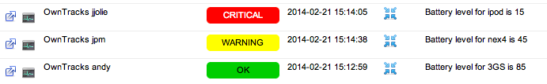

The [JSON payload our devices publish](https://github.com/owntracks/owntracks/wiki/JSON) contains the battery level of the device. (On the Android app this requires checking an advanced setting -- it's optional there.)

The rest is a simple matter of configuring Icinga/Nagios to accept passive checks, and a small Python program which subscribes to OwnTracks messages at `owntracks/+/+`, extracts username and device name as well as the battery level, and submits NSCA checks.




### icinga configuration

```
define service{
        use                             passive-service         ; Name of service template to use
        host_name                       localhost
        service_description             OwnTracks jpm
        }
define service{
        use                             passive-service         ; Name of service template to use
        host_name                       localhost
        service_description             OwnTracks jjolie
        }

define service{
        use                             passive-service         ; Name of service template to use
        host_name                       localhost
        service_description             OwnTracks andy
        }
```

Requires [pynsca](https://github.com/djmitche/pynsca)
