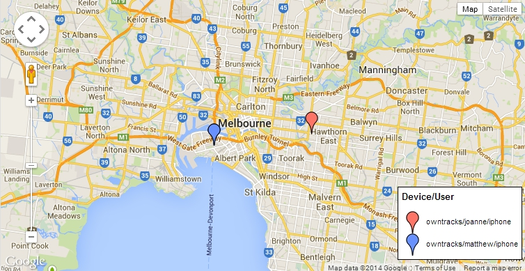

# gmaps

To be used with the [owntracks.org](http://owntracks.org/) project. Subscribes to a topic and plots the OwnTracks position in realtime using websockets.

## Requires

* MQTT Websocket server (e.g. [WSS] or [HiveMQ])
* OwnTracks app [owntracks]
* Google maps API key which you can obtain [here](https://code.google.com/apis/console)
* The PAHO [JavaScript client](http://git.eclipse.org/c/paho/org.eclipse.paho.mqtt.javascript.git/plain/src/mqttws31.js)

## Setup
1. Edit the config.js file and add you websockets server and the owntracks topic you wish to subscribe to.
2. Edit the owntracks-gmaps.html file and replace XXXXXXXXXXXXX with your google maps api key that you obtained.

Created by [Matthew Bordignon] (https://twitter.com/bordignon).

  [wss]: https://github.com/stylpen/WSS/tree/mqtt
  [HiveMQ]: http://www.hivemq.com
  [owntracks]: http://www.owntracks.org
