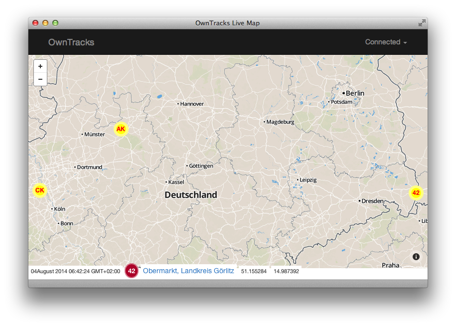
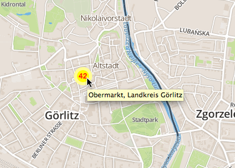
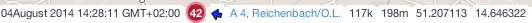
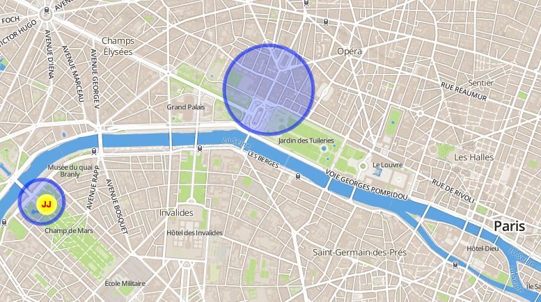

# OwnTracks Live Map

This is a map which will show [OwnTracks] activity live on a Web page. The page
connects via [MQTT] to a Websockets-enabled MQTT broker and updates a map with
positions of OwnTracks users.

Because OwnTracks topic names can become quite long (e.g. `owntracks/jpm/nexus4`)
we introduce the notion of a _user name_, a one or two character string which
identifies a particular OwnTracks device. These could be the initials of a user
(e.g. `JP`), the number of an OwnTracks-enabled vehicle (e.g. `42`) or anything.
(You configure these  _topic_ to _user name_ mappings in the `users.json` file which is
loaded when the app starts.)

These users are displayed on a map, and their current positions are updated in
realtime. In addition, the app performs reverse Geo lookups to show the name
of a user's location, which is updated at the bottom of the screen (see above)
and is added to the _hover_ text of a user on the map:

If the JSON payload of a location publish contains course-over-ground (`cog`), velocity
(`vel`) and altitude (`alt`) elements, these are displayed accordingly. (Note that these
attributes are currently set only by our [Greenwich software](https://github.com/owntracks/gw).) The arrow indicates course-over-ground and moves accordingly.

Geo-fence support is available; see comments in the configuration file and the JSON in
`geo-fences.json`.

### Installation

1. Obtain an API key at [mapbox.com](http://mapbox.com)
2. Copy `config.js.example` to `config.js` and edit, adding your ApiKey which looks like 'username.i888e8e8x'.
3. <del>Copy `users.json.example` to `users.json` and edit. This is the file which contains a mapping from OwnTracks MQTT topic name to _user name_.</del>
4. Point a browser at `index.html`

Step #3 has been deprecated, as we now have support for `tid` (tracker ID) in the JSON payloads. If unset, `tid` defaults to the last two characters of the topic name.

## Websocket

This app has been tested with the `tls` branch of of [WSS](https://github.com/stylpen/WSS/) as
well as with the (currently experimental) [Mosquitto](http://mosquitto.org) Websocket support. (See [this post for more information](http://jpmens.net/2014/07/03/the-mosquitto-mqtt-broker-gets-websockets-support/).)

If the connection between the app and the MQTT broker dies, the app will attempt to reconnect every few seconds.

## Credits

* A lot of JavaScript/CSS help from [Severin Schols](https://github.com/tiefpunkt)
* [Leaflet.js](http://leafletjs.com)
* [jQuery](http://jquery.com/)
* [Paho JavaScript Client](http://www.eclipse.org/paho/clients/js/)

 [owntracks]: http://www.owntracks.org
 [mqtt]: http://mqtt.org

