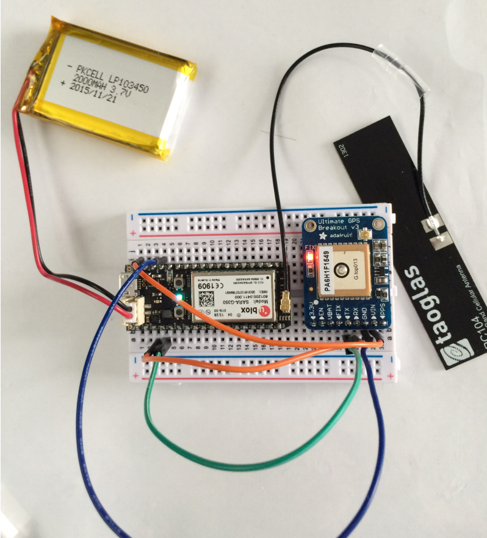
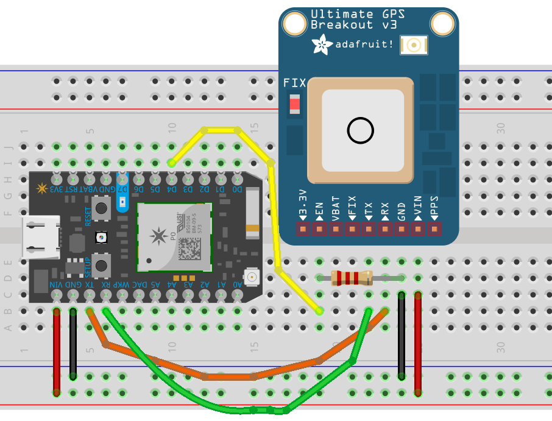
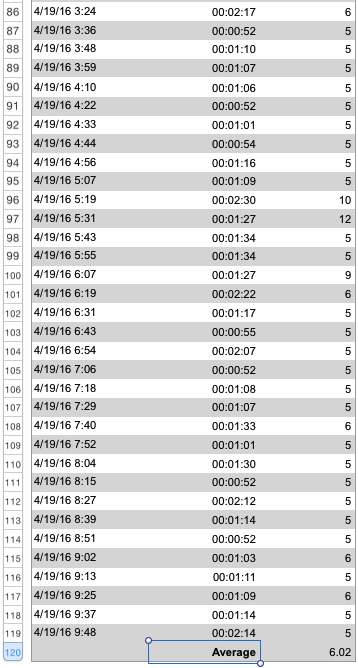

# electron

This is a proof of concept for implementing an [OwnTracks]-compatible device on a [Particle Electron](https://docs.particle.io/datasheets/electron-datasheet/). The photo shows the setup on a mini breadboard with (from left to right), the Electron's LiPo battery, the Electron and an [Adafruit Ultimate GPS](https://www.adafruit.com/products/746) on the breadboard, and the Electron's antenna.



The intention was to have the device report via MQTT (which is possible since the [v0.5.0-rc.1 firmware](https://github.com/spark/firmware/releases)), but we've dropped this idea for a number of reasons:

* No TLS
* The TCP traffic churns through the data plan
* possible instability

The second idea, the Electron should periodically and frequently publish a single Particle _variable_ named `status` with a CSV string in, it we also dropped because the CPU load this was causing drained the LiPo in less than 24 hours.

What we now do is the Electron publishes, via the Particle cloud, a variable at a fixed _interval_ (user-configurable by invoking the `interval` Particle function OTA); the device then puts itself into deep sleep mode.

The published _data_ is a CSV string which contains, from left to right:

```
1460104015,48.854458,2.333510,69.0,600
```

* timestamp (`tst`)
* latitude (`lat`)
* longitude (`lon`)
* battery level (`batt`), actually _State of Charge_
* interval (`_interval`)


A backend Python program listens for PRIVATE events named `owntracks` from the the Particle Cloud, verifies the publishing device matches the configured _device_id_, and publishes the data to an MQTT broker in typical [OwnTracks JSON format](http://owntracks.org/booklet/tech/json/), with a `tid` constructed from the last two digits of the Electron's _deviceID_:

```json
{
    "_type": "location",
    "batt": 69.0,
    "lat": 48.854458,
    "lon": 2.33351,
    "tid": "38",
    "_interval": 600,
    "tst": 1460104015
}
```

## Wiring



When using the Ultimate GPS, we can connect the `EN`able pin to the Electron to switch off the GPS module whilst the Electron is asleep (as shown with the optional yellow connection). A 2.2K resistor between `EN` and `GND` will ensure the module is off by default.

> The LED on the GPS module blinks at about 1Hz while it's searching for satellites and blinks once every 15 seconds when a fix is found to conserve power


## Compiling

Compile the `src/` directory in the cloud; if you're on Unix/Linux you should be able to type `make flash`:

```
$ particle compile electron src/ --saveTo owntracks.bin

Compiling code for electron
...

Compile succeeded.
Saved firmware to: owntracks.bin
```

Then flash the resulting firmware file (i.e. `owntracks.bin`) to your Electron using: ([documentation](https://docs.particle.io/guide/tools-and-features/cli/core/#flashing-over-serial-for-the-electron)):

```
$ particle flash --serial owntracks.bin
```

## Interval

The Electron will publish at a default interval of 10 seconds. You can change the interval to, say, 600 seconds, with something like the following as long as your Electron is currently _online_ and connected to the Particle cloud:

```bash
#!/bin/sh
access_token=xxxxxxxxxxxxxxxxxxxxxxxxxxxxxxxxxxxxxxxx
devid=nnnnnnnnnnnnnnnnnnnnnnnn

curl https://api.particle.io/v1/devices/${devid}/interval \
	-d access_token="${access_token}" \
	-d arg="600"
```

The new interval is writen to EEPROM and survices loss of power.

Our measurements show that, when used with an inexpensive u-blox Neo 6M GPS module, and having the Electron publish its location every 10 minutes (600 seconds), it will last approximately 26 hours on a single charge of its LiPo battery and will have transmitted approximately 5.5KB of data per location publish, which is due to the wakeup from _deep sleep_ and all the overhead that entails (connect to Particle Cloud, DTLS, CoAP, etc.). Note that the net payload we transmit is approx 40 bytes, depending on the "width" of the _lat_/_lon_ coordinates.


## Requirements

The Electron firmware requires:

* [TinyGPS++](https://github.com/codegardenllc/tiny_gps_plus), a copy of which is included in `src/`.
* [particle-cli](https://github.com/spark/particle-cli) installed to compile the sketch and flash it to the Electron.

The back-end `obtain.py` program requires:

* [paho-mqtt](https://pypi.python.org/pypi/paho-mqtt/) (`pip install paho-mqtt`)
* [sseclient](https://pypi.python.org/pypi/sseclient/) (`pip install sseclient`)

## Numbers

Over a period of almost 24 hours, the Electron has been waking up from deep sleep once every 10 minutes (600s) to obtain a GPS fix and publish that as described above. We are seeing an average data consumption of 6.02 kilobyte per event. This includes the overhead of connecting to provider, handshakes, Particle Cloud connection, publishing the net data payload, etc.



These numbers were obtained directly from the SIM-card provider.

The Electron ran for 76 hours (just over three days) on a single charge of it's Lipo battery, publishing every 10 minutes (600 seconds). During this time, we noticed twice that the device went into listening mode, sometimes for 3 or more hours, until we hit `RESET`, in spite of enabling/disabling Cellular in the sketch, as per recommendation.

## Boot

When the Electron wakes up, the following sequence of LED flashes will be displayed:

1. GREEN flashing: the Electron is obtaining access to the GPRS network
2. Fast BLUISH flashing: the Electron has cellular network and is booting
3. RED / BLUE alternating: we are waiting for a GPS fix
4. GREEN flashing: disconnecting from cellular, and going into deep sleep

  [OwnTracks]: http://owntracks.org
