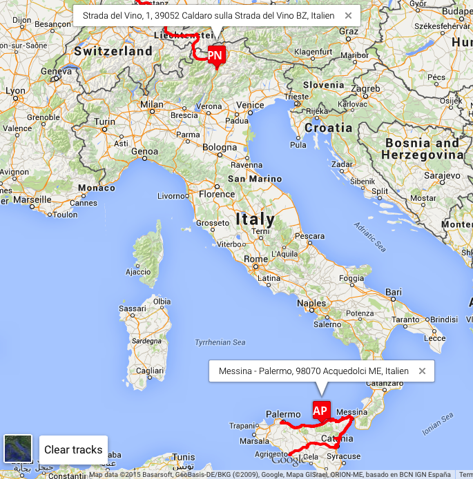

# Pista Micro

_Pista Micro_ is a lightweight Pista, designed for a handful of devices. This relies on the database maintained by `o2s` but is much easier to setup than the full-blown _Pista_ is. In other words, you run `o2s` and use _Pista Micro_ with its data.

## Configuration

Under the assumption that you've already been running `o2s` and actually have some data, configuration of _Pista Mini_ should be rather easy:

1. Copy `config.php.sample` to `config.php` and edit. In particular the list of _topics_ we should use needs adjusting as well as the path to the font file you want to use to label markers with device _TID_s.
2. Copy all the files to your Web server which needs PHP 5 with MySQL and GD.

## Using

1. A click on one of the markers (TID) on the map will load the GeoJSON track from the back-end database. By default the last 200 points are loaded, but this can be configured on a by-topic base.
2. Clicking on the _Clear tracks_ button removes all the tracks.
3. Hovering over a TID should display the device's currently location (if _o2s_ is storing that).

## Credits

* The logo was adapted from the OwnTracks logo for _Pista Micro_ by Christoph Krey
* The [OpenSans-Bold font](http://www.fontsquirrel.com/fonts/open-sans)
